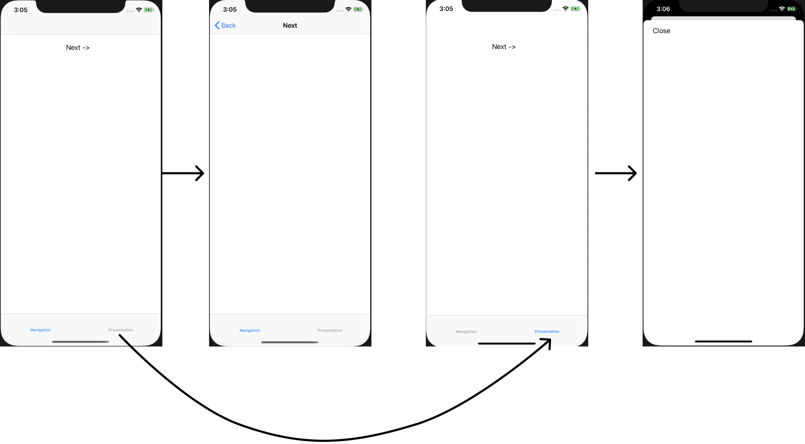

# UIKit navigation basics
# Часть 1
Вам необходимо создать iOS приложение с базовыми элементами навигации UIKit: 
 - UITabBarController с табами
 - UINavigationController со стеком вложенных экранов
 - UIViewController, который модально показывает другой UIViewController

В этом задании для создания экранов и переходов между ними используйте стандартный Single View App шаблон Xcode проекта для iOS с user interface в виде stroyboard. Все экраны должны быть созданы в файле Main.storyboard.
Приложение имеет следующую структуру:
Пользователь видит 2 таба и выбранный экран.
На первом экране располагается кнопка, которая открывает следующий экран в стандартном стеке навигации используя UINavigationController. Для возвращения назад используется стандартная копка back.
На втором экране располагается кнопка, которая показывает модально экран с копкой “Закрыть”. По нажатию на “Закрыть” модальный экран закрывается.
Когда вся навигация будет реализована, добавьте названия экранам, они должны отображаться на tab bar (для табов) и в naivigation bar (для экрана показанного в стеке UINavigationController), см примерный дизайн ниже.

# Часть 2
Удалите из проекта получившегося в первой части файл storyboard. Реализуйте все то же самое не используя UI Builder

# Часть 3
Оба контейнера (UITabBarController и UINavigationController), позволяют работать в массивом вложенный UIViewController `var viewControllers: [UIViewController]`
Используйте наработки из части 2 и сделайте так, что при старте приложения случайным образом создается от 1 до 8 табов и каждый из них является либо экраном с модальной навигацией либо экраном со стеком навигации.
